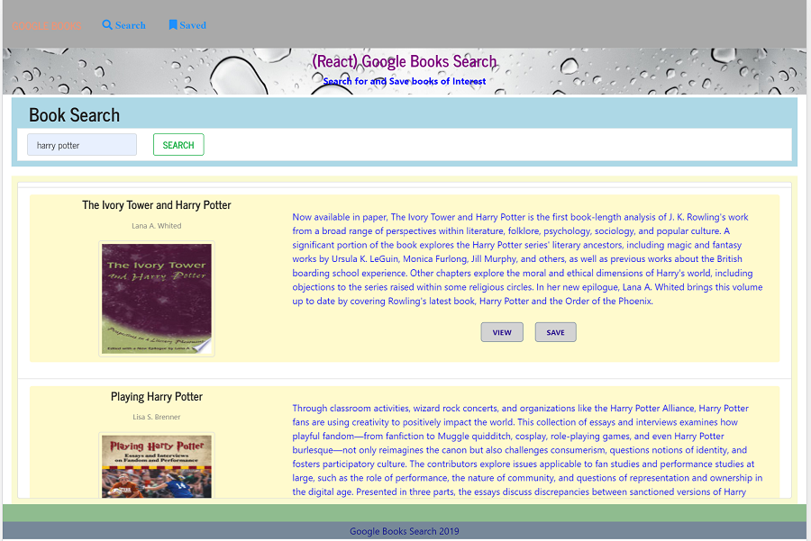
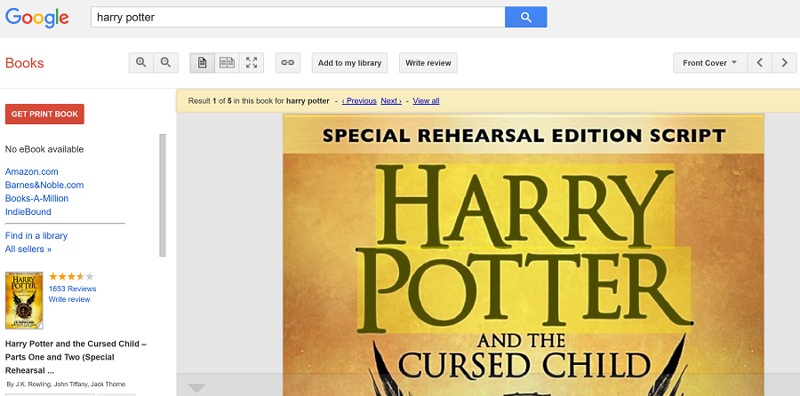
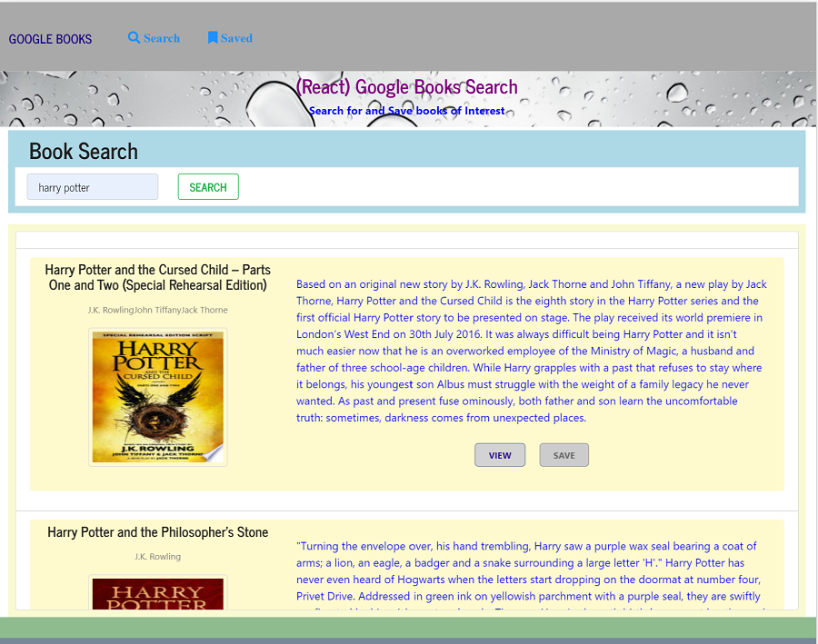
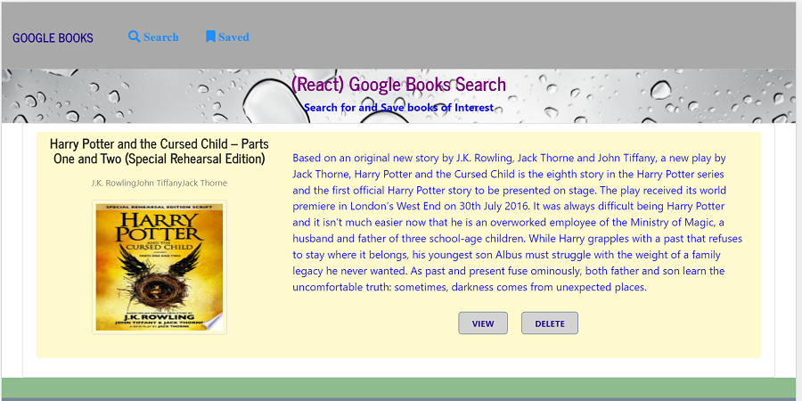

# Google Books Search

### Overview

A new React-based Google Books Search app. It's a SPA (Single Page Application) that uses [`react-router-dom`] to navigate, hide and show  React components without changing the route within Express.
 Creating React components, woking with helper/util functions, and utilizing React lifecycle methods to query and display books based on user searches. Use Node, Express and MongoDB ,so that users can save books to review or purchase later.

* user can search a google book by inputting a book name. After gets the result, user can view a book or save a book for later view. 
* User can access the saved books and view them. If user doesn't want to save any book,  user can delete it from the saved books.
 

### App Live Link
https://blooming-anchorage-27257.herokuapp.com/

### App GitHub Link
https://github.com/helenhao888/google-book-search.git

### Developer
    Developed by Helen Hao (helenhao888)
    
### Technologies
    
    React.js 
    JSX
    MVC design 
    javascript/ES6    
    HTML
    CSS   
    Express
    MongoDB/Mongoose 
    JSON
    Path
    Google Books API
    HeroKu/GitHub

### Screenshots
1. Search Book  
   * Loading Result
   
   * Get searched books
   
2. View book
    
   

3.  Save book and View Saved Book     
   * save a book
   
   * view saved book
   

4.   Delete Book
   

### Contact Information

   Helen Hao :
   :link:[linkedIn](https://www.linkedin.com/in/jinzhao-helen-hao-611b3752/) 
   :link:[Portfolio](https://helenhao888.github.io)       
